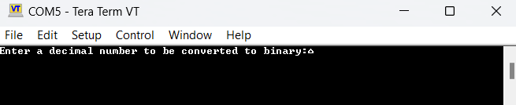
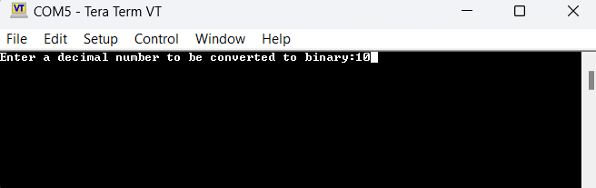
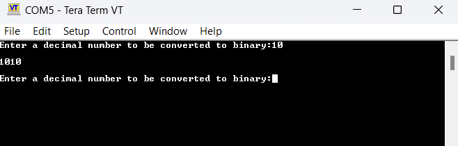

# **004_UART_Transmit_Receive**

This project demonstrates UART communication on an STM32 nano board to transmit and receive data using a terminal emulator (e.g., Teraterm). 

## **Overview**

The primary goal of this project is to establish bidirectional communication between the microcontroller and a terminal emulator application, enabling the transmission and reception of data. Moreover, it incorporates a feature that converts a received decimal number to its binary representation and sends it back.

## **Functionality**

- **UART Configuration**: 
  - The program configures UART for communication, enabling data transmission and reception.
  - Ensure that the UART settings (baud rate, data bits, stop bits, and parity) are correctly matched between the microcontroller and the terminal emulator.
  
- **Transmit Data**: 
  - Predefined messages and prompts are transmitted from the microcontroller to the terminal emulator, guiding users to input decimal numbers.

- **Receive Data**: 
  - The microcontroller listens for user input via the terminal emulator and processes the received data.

- **Decimal-to-Binary Conversion**: 
  - When a user inputs a decimal number via the terminal emulator, the microcontroller converts the decimal input into its binary representation.
  - The binary result is transmitted back to the terminal emulator for display.

## **Example Workflow**

1. The microcontroller sends a prompt asking the user to input a decimal number.

2. The user inputs a decimal number in the terminal emulator.

3. The microcontroller receives the number, converts it to binary, and transmits the binary representation back to the terminal for display.

## **Terminal Emulator Setup**

- **Baud rate**: 38400
- **Data bits**: 8
- **Parity**: None
- **Stop bit**: 1

Ensure these settings match in both the STM32 microcontroller configuration and the terminal emulator (e.g., Teraterm) to establish proper communication.

