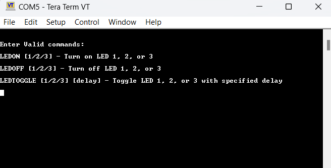

# 005_UART_LED_Control_IT

This program to controls the three LEDs (Red, Green, and Blue) on the STM32 Nano board via UART commands.

## Overview

The program leverages UART (Universal Asynchronous Receiver-Transmitter) communication to receive commands from an external device or terminal. Based on the received commands, the program controls the LEDs connected to the GPIO pins of the microcontroller.

## Functionality

The program sends a menu of valid commands through the UART interface. Users can interact with the system using a terminal emulator (e.g., Teraterm) or any other device connected to the microcontroller's UART interface.

  

## Available Commands

- **`LEDON [1/2/3]`**: Turns on the respective LED.
  - `LEDON 1`: Turns on the Red LED
  - `LEDON 2`: Turns on the Green LED
  - `LEDON 3`: Turns on the Blue LED

- **`LEDOFF [1/2/3]`**: Turns off the respective LED.
  - `LEDOFF 1`: Turns off the Red LED
  - `LEDOFF 2`: Turns off the Green LED
  - `LEDOFF 3`: Turns off the Blue LED

- **`LEDTOGGLE [1/2/3] [delay]`**: Toggles the specified LED with a delay between each toggle.
  - `LEDTOGGLE 1 [delay]`: Toggles the Red LED
  - `LEDTOGGLE 2 [delay]`: Toggles the Green LED
  - `LEDTOGGLE 3 [delay]`: Toggles the Blue LED
  - **delay**: Time interval (in milliseconds) for toggling the LED on and off.

## Example Usage

- To turn on the Red LED:
  ```plaintext
  LEDON 1

- To turn off the Green LED:
  ```plaintext
  LEDOFF 2

- To toggle the Blue LED every 500 milliseconds:
  ```plaintext
  LEDTOGGLE 3 500

### Feedback Messages

The program will respond with the following feedback messages based on the received commands:

1. **"Invalid Command"**: If an unrecognized command is received.
2. **"Invalid Argument"**: If an incorrect LED number (other than 1, 2, or 3) is provided.

## UART Settings

Ensure that your UART communication settings match the following configuration:
- **Baud rate**: 38400
- **Data bits**: 8
- **Parity**: None
- **Stop bits**: 1

The communication must be set up accordingly in the terminal or any other external device for proper operation.

## Additional Notes

- Make sure the STM32 Nano board is correctly powered and connected to the UART interface for successful communication.
- Commands are case-sensitive; ensure proper formatting when sending instructions.


