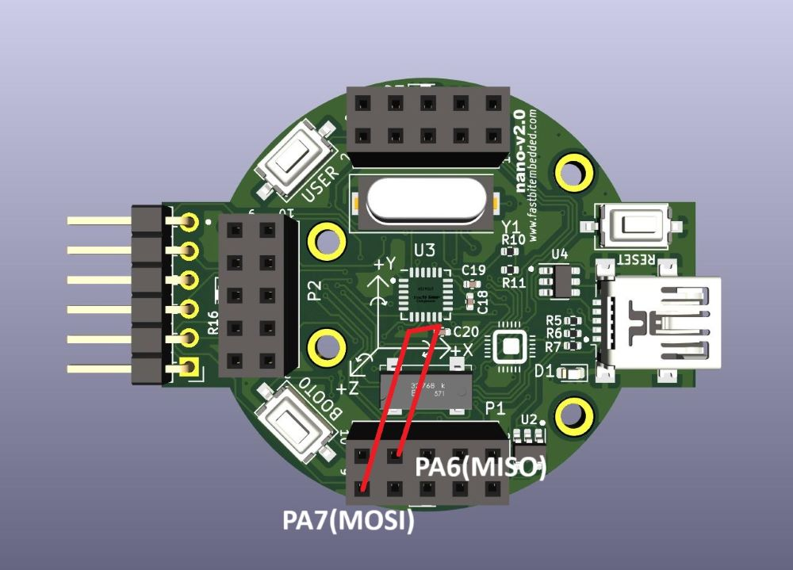
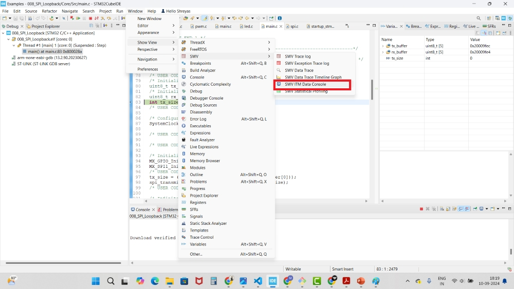
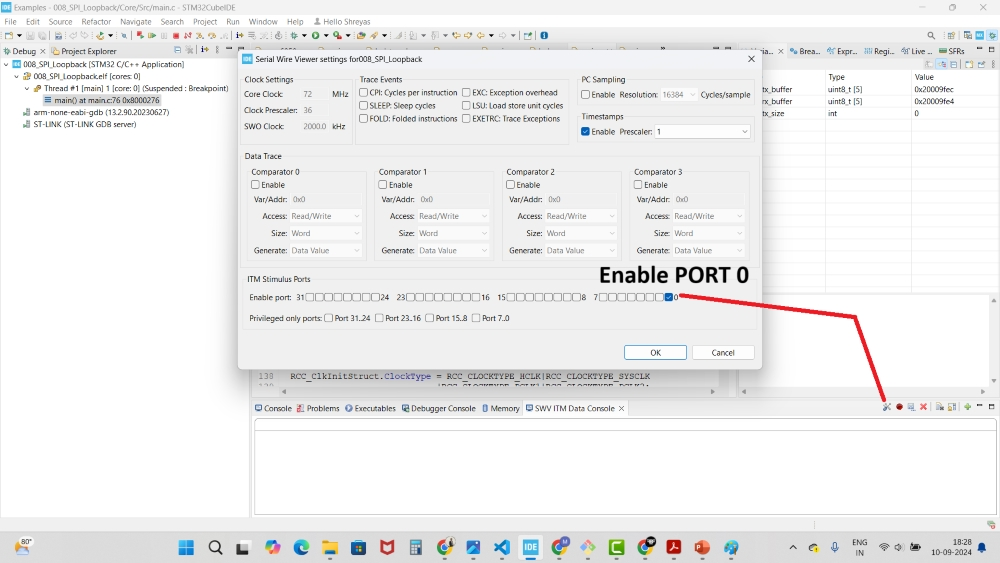
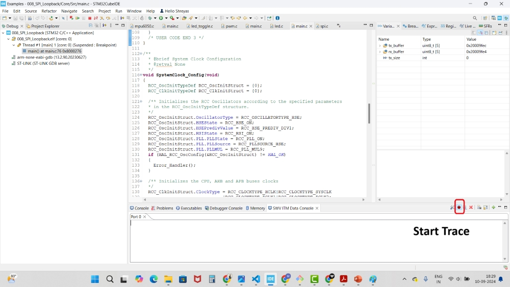
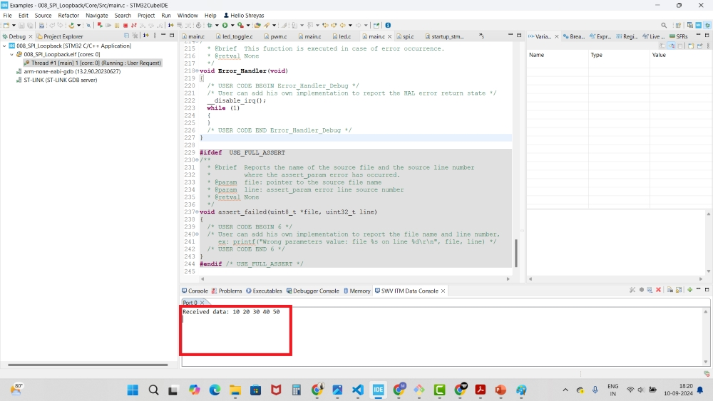

# 008_SPI_Loopback

This project demonstrates SPI (Serial Peripheral Interface) loopback data transmission on the STM32 nano board.

## Overview

The program establishes an SPI loopback connection, allowing the microcontroller to transmit and receive data internally via the SPI protocol.

## Functionality

### Data Transmission:
  - A predefined transmit buffer is initialized with sample data.
  - The data is transmitted over SPI, and simultaneously received through the loopback connection.
  - The received data can be monitored using the SWV ITM Data Console, which is part of the debugging interface.
  - **Loopback data is displayed in the SWV ITM console via the SWO pin of the STLink.**

## Steps to Use:
1. To enable the loopback, connect a wire between the **SPI_MOSI** (PA7) and **SPI_MISO** (PA6) pins.
   
   
2. Build and debug the code using **STM32CubeIDE**.
3. Open the **SWV ITM Console** window in the IDE.
   
   
4. In the **SWV ITM Console** settings, enable **PORT 0**.
   
   
5. Start the **Trace**.
   
   
6. View the looped-back data in real time as it is transmitted and received.
   
   

**Note:** You will need an STLink debugger with an SWO pin to view the loopback data in the SWV ITM Data Console. 

