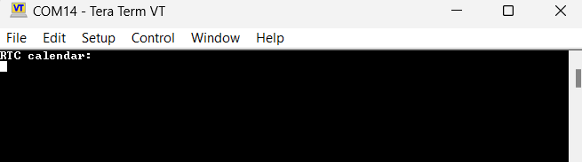
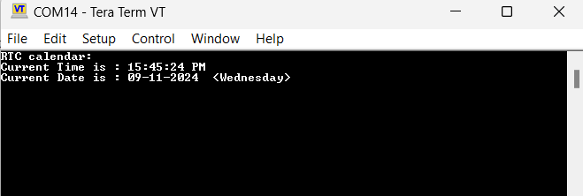

# *011_USB_VCOM_Transmit*

The USB_VCOM project displays the current RTC (Real-Time Clock) time using the STM32 Nano board. The time is transmitted over USB through a virtual COM port using the CDC (Communication Device Class) interface.


## Features

- Transmits current RTC time and date over a USB virtual COM port.
- Uses the STM32 onboard user button to trigger the transmission.
- Data can be viewed through any terminal emulator (e.g., PuTTY, Tera Term).

## How It Works

- The user button on the STM32 board is used to trigger the transmission of the current RTC time and date.
- Upon button press, the code reads the RTC and sends the data to the USB virtual COM port.
- The data can be viewed on a PC using any terminal emulator to monitor the USB COM port.



* Example: When the button is pressed, the RTC time and date are transmitted to the terminal emulator.



## Configuration

You can modify the initial RTC time and date settings by editing the `MX_RTC_Init` function in the `main.c` file.

```c
hrtc.Instance = RTC;
hrtc.Init.HourFormat = RTC_HOURFORMAT_12;
hrtc.Init.AsynchPrediv = 127;
hrtc.Init.SynchPrediv = 255;
hrtc.Init.OutPut = RTC_OUTPUT_DISABLE;
hrtc.Init.OutPutPolarity = RTC_OUTPUT_POLARITY_HIGH;
hrtc.Init.OutPutType = RTC_OUTPUT_TYPE_OPENDRAIN;
if (HAL_RTC_Init(&hrtc) != HAL_OK)
{
  Error_Handler();
}

sTime.Hours = 15;                       // Set hour
sTime.Minutes = 45;                     // Set minutes
sTime.Seconds = 24;                     // Set seconds
sTime.TimeFormat = RTC_HOURFORMAT12_PM;
sTime.DayLightSaving = RTC_DAYLIGHTSAVING_NONE;
sTime.StoreOperation = RTC_STOREOPERATION_RESET;

if (HAL_RTC_SetTime(&hrtc, &sTime, RTC_FORMAT_BIN) != HAL_OK)
{
  Error_Handler(); 
}

// Set the RTC date
sDate.WeekDay = RTC_WEEKDAY_WEDNESDAY;   // Set weekday
sDate.Month = RTC_MONTH_SEPTEMBER;       // Set month
sDate.Date = 11;                         // Set date
sDate.Year = 24;                         // Set year to 2024
if (HAL_RTC_SetDate(&hrtc, &sDate, RTC_FORMAT_BIN) != HAL_OK)
{
  Error_Handler();  
}
