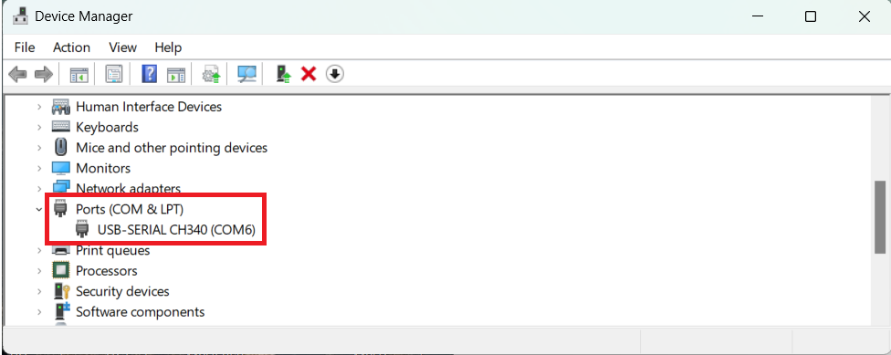

# **013_MPU6050_3D_Model**

This project demonstrates how to visualize MPU6050 sensor data in a 3D model using the Processing IDE. The MPU6050 sensor captures motion data, which is transmitted over UART to a computer. The Processing script reads this data and renders a 3D model representing the motion of the sensor.

## **Processing Visualization**

### **1. Install Processing**
Download and install the Processing IDE from [Processing.org](https://processing.org/download).

### **2. Open Script**
Open the `MPU6050_3D_model.pde` script located in the `processing/` directory.

### **3. Adjust COM Port**
Update the COM port in the Processing script to match your system setup.

### **4. Run Script**
Run the Processing script to start visualizing the MPU6050 sensor data in real-time.
